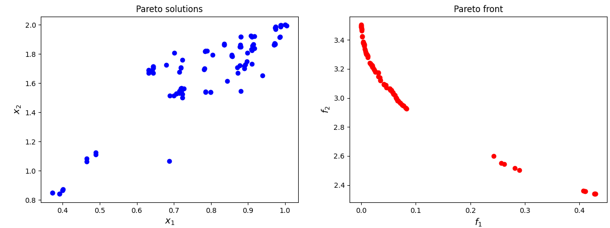

[](https://www.python.org/downloads/release/python-3106/)
[](https://opensource.org/licenses/Apache-2.0)
[](https://zenodo.org/badge/latestdoi/562917525)


## NSMA: A Memetic Procedure for Global Multi-Objective Optimization

Implementation of the NSMA Algorithm proposed in

[Lapucci, M., Mansueto, P. & Schoen, F. A memetic procedure for global multi-objective optimization. Math. Prog. Comp. (2022).](
https://doi.org/10.1007/s12532-022-00231-3)

If you have used our code for research purposes, please cite the publication mentioned above.
For the sake of simplicity, we provide the Bibtex format:

```
@Article{Lapucci2022,
    author={Lapucci, Matteo and Mansueto, Pierluigi and Schoen, Fabio},
    title={A memetic procedure for global multi-objective optimization},
    journal={Mathematical Programming Computation},
    year={2022},
    month={Nov},
    day={22},
    issn={1867-2957},
    doi={10.1007/s12532-022-00231-3},
    url={https://doi.org/10.1007/s12532-022-00231-3}
}
```

### Installation

In order to execute the code, you need an [Anaconda](https://www.anaconda.com/) environment. We provide YAML file in order to facilitate the installation of the latter.

##### For Windows user

Open an Anaconda Prompt in the project root folder and execute the following command.

```
conda env create -f Environment_Setups/Windows.yml
```

##### For Linux user

Open a terminal in the project root folder and execute the following command.

```
conda env create -f Environment_Setups/Linux.yml
```

##### For MacOSX user

Open a terminal in the project root folder and execute the following command.

```
conda env create -f Environment_Setups/MacOSX.yml
```

#### Main Packages

* ```python v3.10.6```
* ```pip v22.2.2```
* ```numpy v1.22.3```
* ```scipy v1.7.3```
* ```matplotlib``` Windows: ```v3.5.3```, Linux: ```v3.5.2```, MacOSX: ```v3.6.1```
* ```tensorflow``` Windows: ```v2.9.1```, Linux: ```v2.8.2```, MacOSX: ```v2.10.0```
* ```gurobipy v9.5.2```
* ```progressbar2 v4.2.0```

#### Gurobi Optimizer

In order to run some parts of the code, the [Gurobi](https://www.gurobi.com/) Optimizer needs to be installed and, in addition, a valid Gurobi licence is required. 
However, the employment of the Gurobi Optimizer is not mandatory to execute the code. 
Indeed, we provide alternative scripts where the HiGHS dual simplex solver implementation by [SciPy](https://scipy.org/) is used. The latter is the default choice as can be seen in ```parser_management.py```. 
The Gurobi optimizer can be only employed by activating an argument (```-g```, ```--gurobi```). 

### Usage

We refer to the code documentation for all the information. In particular, in ```parser_management.py``` you can find all the possible arguments.
Given a terminal (an Anaconda prompt, if you are a Windows user), an example of execution could be the following.

```python main.py --algorithms NSMA --problems MAN --seeds 16007 --max_time 2 --verbose --plot_pareto_front --plot_pareto_solutions -g --general_export --general_export_pareto_solutions```

The execution results are saved in the ```Execution_Outputs``` folder. In ```General_Utils/Management_Utils.py``` and ```General_Utils/Args_Utils.py```, you can find all the documentation about how the outputs are stored.

### Python Library

The code is also proposed as [Python package](https://pypi.org/project/nsma/). In order to use it, execute the following command under your conda environment:

```
pip install nsma
```

Note that, for a successful installation, you need Python v3.10.6 in your Conda environment.

Below, an example of library usage is proposed.

```python
import tensorflow as tf
from nsma.algorithms.memetic.nsma import NSMA
from nsma.problems.man.man_instance import MAN1
from nsma.general_utils.pareto_utils import points_initialization

tf.compat.v1.disable_eager_execution()

session = tf.compat.v1.Session()
with session.as_default():
    algorithm = NSMA(max_iter=None, 
                     max_time=2, 
                     max_f_evals=None, 
                     verbose=True, 
                     verbose_interspace=10, 
                     plot_pareto_front=True, 
                     plot_pareto_solutions=False, 
                     plot_dpi=100, 
                     pop_size=100, 
                     crossover_probability=0.9, 
                     crossover_eta=20, 
                     mutation_eta=20, 
                     shift=10, 
                     crowding_quantile=0.9, 
                     n_opt=5, 
                     FMOPG_max_iter=5, 
                     theta_for_stationarity=-1e-10, 
                     theta_tol=-1e-1, 
                     theta_dec_factor=10**(-0.5), 
                     gurobi=True, 
                     gurobi_method=1, 
                     gurobi_verbose=False, 
                     ALS_alpha_0=1, 
                     ALS_delta=0.5, 
                     ALS_beta=10**-4, 
                     ALS_min_alpha=1e-7)
    problem = MAN1(n=5)
    initial_p_list, initial_f_list, n_initial_points = points_initialization(problem, 'hyper', 5)
    p_list, f_list, elapsed_time = algorithm.search(initial_p_list, initial_f_list, problem)
```

### Contact

If you have any question, feel free to contact me:

[Pierluigi Mansueto](https://webgol.dinfo.unifi.it/pierluigi-mansueto/)<br>
Global Optimization Laboratory ([GOL](https://webgol.dinfo.unifi.it/))<br>
University of Florence<br>
Email: pierluigi dot mansueto at unifi dot it
